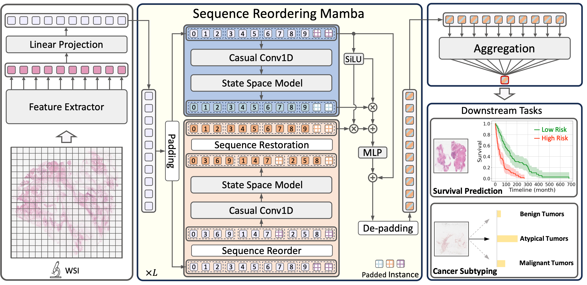

# MambaMIL: Enhancing Long Sequence Modeling with Sequence Reordering in Computational Pathology


[](https://opensource.org/licenses/MIT)


[](https://arxiv.org/pdf/2403.06800.pdf)




## Abstract

> Multiple Instance Learning (MIL) has emerged as a dominant paradigm to extract discriminative feature representations within Whole Slide Images (WSIs) in computational pathology. Despite driving notable progress, existing MIL approaches suffer from limitations in facilitating comprehensive and efficient interactions among instances, as well as challenges related to time-consuming computations and overfitting. In this paper, we incorporate the Selective Scan Space State Sequential Model (Mamba) in Multiple Instance Learning (MIL) for long sequence modeling with linear complexity, termed as MambaMIL. By inheriting the capability of vanilla Mamba, MambaMIL demonstrates the ability to comprehensively understand and perceive long sequences of instances. Furthermore, we propose the Sequence Reordering Mamba (SR-Mamba) aware of the order and distribution of instances, which exploits the inherent valuable information embedded within the long sequences. With the SR-Mamba as the core component, MambaMIL can effectively capture more discriminative features and mitigate the challenges associated with overfitting and high computational overhead. Extensive experiments on two public challenging tasks across nine diverse datasets demonstrate that our proposed framework performs favorably against state-of-the-art MIL methods. 

## NOTES
**2024-04-12**: For subsequent updates of the paper, We will update the arixv version in next month.

**2024-04-13**: We released the model of MambaMIL. The whole training code is coming soon.

**2024-04-24**: We released the full version of MambaMIL, including models and train scripts.

## Installation
* Environment: CUDA 11.8 / Python 3.10
* Create a virtual environment
```shell
> conda create -n mambamil python=3.10 -y
> conda activate mambamil
```
* Install Pytorch 2.0.1
```shell
> pip install torch==2.0.1 torchvision==0.15.2 torchaudio==2.0.2 --index-url https://download.pytorch.org/whl/cu118
> pip install packaging
```
* Install causal-conv1d
```shell
> pip install causal-conv1d==1.1.1
```
* Install Mamba
```shell
> git clone git@github.com:isyangshu/MambaMIL.git
> cd mamba
> pip install .
```
* Other requirements
```shell
> pip install scikit-survival==0.22.2
> pip install pandas==2.2.1
> pip install tensorboardx
> pip install h5py
> pip install wandb
> pip install tensorboard
> pip install lifelines
```

## Repository Details

<!-- * `csv`:  Complete Cbioportal files, including the features path and data splits with 5-fold cross-validation. 
* `datasets`: The code for Dataset, you can just replace the path in Line-25. -->
* `mamba`: including the original Mamba, Bi-Mamba from Vim and our proposed SRMamba.
* `models`: Support the following model:
  - [Mean pooling](https://github.com/isyangshu/MambaMIL/tree/main/models/Mean_Max_MIL.py) 
  - [Max pooling](https://github.com/isyangshu/MambaMIL/tree/main/models/Mean_Max_MIL.py) 
  - [ABMIL](https://github.com/isyangshu/MambaMIL/tree/main/models/ABMIL.py)  
  - [TransMIL](https://github.com/isyangshu/MambaMIL/tree/main/models/TransMIL.py)
  - [S4MIL](https://github.com/isyangshu/MambaMIL/tree/main/models/S4MIL.py)
  - [Our MambaMIL](https://github.com/isyangshu/MambaMIL/tree/main/models/MambaMIL.py)
<!-- * `results`: the results on 12 datasets, including BLCA BRCA CESC CRC GBMLGG KIRC LIHC LUAD LUSC PAAD SARC UCEC. -->
* `splits`: Splits for reproducation.
* `train_scripts`: We provide train scripts for cancer subtyping and survival prediction.

## How to Train
### Prepare your data
1. Download diagnostic WSIs from [TCGA](https://portal.gdc.cancer.gov/) and [BRACS](https://www.bracs.icar.cnr.it/) 
2. Use the WSI processing tool provided by [CLAM](https://github.com/mahmoodlab/CLAM) to extract resnet-50 and [PLIP](https://github.com/PathologyFoundation/plip/tree/main) pretrained feature for each 512 $\times$ 512 patch (20x), which we then save as `.pt` files for each WSI. So, we get one `pt_files` folder storing `.pt` files for all WSIs of one study.

The final structure of datasets should be as following:
```bash
DATA_ROOT_DIR/
    └──pt_files/
        └──resnet50/
            ├── slide_1.pt
            ├── slide_2.pt
            └── ...
        └──plip/
            ├── slide_1.pt
            ├── slide_2.pt
            └── ...
        └──others/
            ├── slide_1.pt
            ├── slide_2.pt
            └── ...
```
### Survival Prediction
We provide train scripts for survival prediction [ALL_512_surivial_k_fold.sh](https://github.com/isyangshu/MambaMIL/tree/main/train_scripts/ALL_512_survival_k_fold.sh).

Below are the supported models and datasets:

```bash
model_names='max_mil mean_mil att_mil trans_mil s4_mil mamba_mil'
backbones="resnet50 plip"
cancers='BLCA BRCA COADREAD KIRC KIRP LUAD STAD UCEC'
```

run the following code for training

```shell
sh ./train_scripts/ALL_512_surivial_k_fold.sh
```

### Cancer Subtyping
We provide train scripts for TCGA NSCLC cancer subtyping [LUAD_LUSC_512_subtyping.sh](https://github.com/isyangshu/MambaMIL/tree/main/train_scripts/LUAD_LUSC_512_subtyping.sh) and BReAst Carcinoma Subtyping [BRACS.sh](https://github.com/isyangshu/MambaMIL/tree/main/train_scripts/train_scripts/BRACS.sh).

Below are the supported models:

```bash
model_names='max_mil mean_mil att_mil trans_mil s4_mil mamba_mil'
backbones="resnet50 plip"
```

run the following code for training TCGA NSCLC cancer subtyping 

```shell
sh ./train_scripts/LUAD_LUSC_512_subtyping.sh
```
run the following code for training BReAst Carcinoma Subtyping 

```shell
sh ./train_scripts/BRACS.sh
```

## Acknowledgements
Huge thanks to the authors of following open-source projects:
- [CLAM](https://github.com/mahmoodlab/CLAM)


## License & Citation 
If you find our work useful in your research, please consider citing our paper at:

```text
@article{yang2024mambamil,
  title={MambaMIL: Enhancing Long Sequence Modeling with Sequence Reordering in Computational Pathology},
  author={Yang, Shu and Wang, Yihui and Chen, Hao},
  journal={arXiv preprint arXiv:2403.06800},
  year={2024}
}
```
This code is available for non-commercial academic purposes. If you have any question, feel free to email [Shu YANG](syangcw@connect.ust.hk) and [Yihui WANG](ywangrm@connect.ust.hk).
